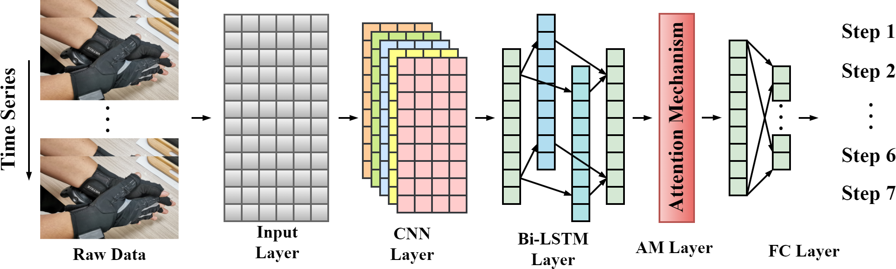

# 🧠 Neural Network Code - Grasp Classification & Continual Learning

This folder contains all the core code for training, evaluating, and extending the neural network model used in the VMG30 dataglove project.

The architecture is based on an **Attention-based Convolutional Bidirectional LSTM Network (A-CBLN)** designed for classifying hand-object interactions from time-series sensor data.


---

## 📁 File Overview

### 🔧 Model & Utilities

- `nn/network.py`  
  Defines the **A-CBLN model** architecture (Attention-based Convolutional BiLSTM Network).

- `nn/early_stopping.py`  
  Implements **early stopping** to avoid overfitting during training.

- `nn/glove_dataset.py`  
  PyTorch `Dataset` class for loading and preprocessing sensor data from the dataset files.

---

### 🏋️‍♂️ Training & Evaluation

- `train.py`  
  Trains the model from scratch using a labeled dataset.  
  Saves the trained model to `checkpoint.pt`.

- `test.py`  
  Evaluates the model on a **test set** or **validation set**:
  
  - Use `--validation` to test on the validation set  
  - Use `--plot` to generate and save a confusion matrix  
  - Use `--checkpoint` to specify which wights to load 

- `preprocessing.py`  
  Utility script for preparing the dataset:
  - Use `--split` to divide the dataset into **train**, **validation**, and **test** sets
  - Use `--k <k>` to generate **k-fold cross-validation** splits


  Example:
  ```bash
  python3 train.py
  python3 test.py --validation --plot
  ```

###  🔁 Continual Learning

- `lwf.py`  
  Implements Learning Without Forgetting (LwF) to add two new object classes without forgetting previous ones.  Saves the new model as `distillated_checkpoint.pt`.

- `der.py`  
  Implements Dark Experience Replay (DER), another continual learning strategy.  Saves the new model as `distillated_checkpoint.pt`.

Both scripts simulate a scenario where a model trained on 4 classes is extended to recognize 6.

### 📊 Sensor & Feature Analysis

- `feature_curve.py`  
  Investigates which features are most discriminative for the classification task.

- `sensor_curve.py`  
  Analyzes sensor importance by studying the contribution of each sensor channel to model accuracy.

These scripts help interpret which parts of the input data are most critical for the model’s predictions.